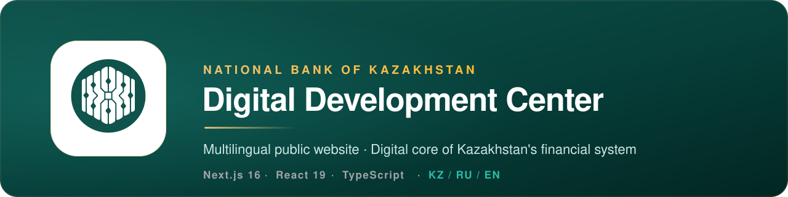
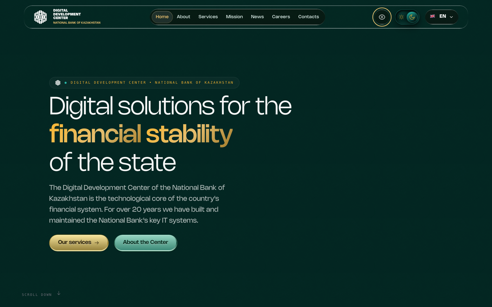
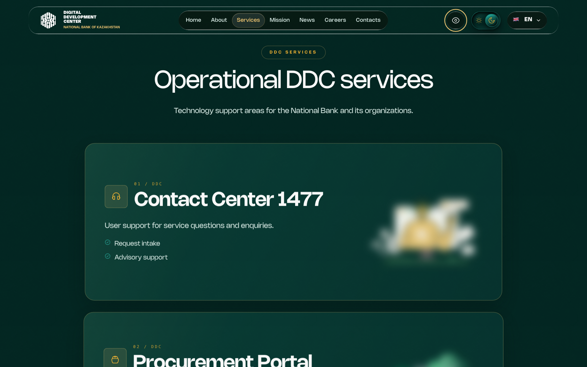
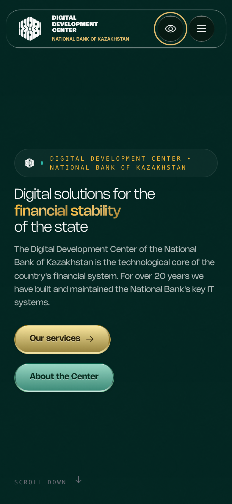
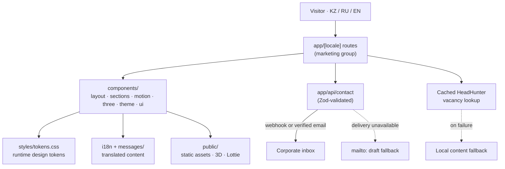

<!-- Banner: authentic DDC medallion on the brand's deep-forest / gold palette -->


# DDCNB Website

Public, multilingual website for the **Digital Development Center (DDC)** in the
National Bank of Kazakhstan ecosystem. It presents DDC information, services,
mission, careers, news, and contact details through premium visual storytelling.

> It is a **marketing and information website** — **not** a transaction system,
> customer portal, or authenticated fintech application. There are no accounts,
> payments, or persisted personal data.

[](https://github.com/mrnamazbek/ddc-nbk-website/actions/workflows/ci.yml)


---

## Contents

- [Overview](#overview)
- [Preview](#preview)
- [Key features](#key-features)
- [Technology stack](#technology-stack)
- [Architecture](#architecture)
- [Accessibility, languages & themes](#accessibility-languages--themes)
- [Getting started](#getting-started)
- [Environment configuration](#environment-configuration)
- [Commands](#commands)
- [Testing & production build](#testing--production-build)
- [Deployment](#deployment)
- [Repository overview](#repository-overview)
- [Documentation](#documentation)
- [Security & privacy](#security--privacy)
- [Contributing](#contributing)
- [License & project status](#license--project-status)

---

## Overview

The Digital Development Center of the National Bank of Kazakhstan is the
technological core of the country's financial system. This repository is its
public website: a fast, accessible, three-language experience that combines
restrained fintech design with premium motion, 3D, and scroll storytelling.

The application is built on the **Next.js App Router** with per-locale routing,
a **runtime design-token system**, and progressive enhancement — heavy visual
scenes load only where they add value and degrade gracefully everywhere else.

---

## Preview

| Home — desktop | Services — desktop |
| :---: | :---: |
|  |  |

<p align="center">
  
  <br/>
  <sub>Home — mobile</sub>
</p>

<sub>Screenshots are captured from the English locale with reduced-motion enabled for stable framing.</sub>

---

## Key features

- **Three languages** — Kazakh, Russian, and English routing with `next-intl`
  (default locale: Russian).
- **Dark & light themes** — a runtime token system driven by `next-themes`;
  the palette switches without duplicating component styles.
- **Accessibility controls** — a low-vision panel, visible focus states,
  keyboard navigation, and reduced-motion fallbacks.
- **Premium motion & storytelling** — scroll choreography, Framer Motion / GSAP,
  Lottie, Spline, and Three.js / React Three Fiber scenes.
- **Marketing content** — home, about, mission, services, careers, news, and
  contact pages, with a cached HeadHunter vacancy lookup that falls back to
  local content.
- **Secure contact handoff** — a validated server endpoint delivers enquiries to
  a corporate webhook or verified email sender, with a `mailto:` draft fallback
  and **no website-side persistence** of the message.
- **Hardened defaults** — a strict Content-Security-Policy and security headers
  are applied to every route; the framework's `X-Powered-By` header is disabled.

---

## Technology stack

| Area | Technology |
| --- | --- |
| Framework | Next.js 16 (App Router), React 19, TypeScript 5 |
| Styling | Tailwind CSS 4, CSS design tokens (`styles/tokens.css`) |
| i18n & theming | `next-intl`, `next-themes` |
| Forms & validation | React Hook Form, Zod |
| Motion | Framer Motion / `motion`, GSAP, Lenis |
| 3D & visuals | Three.js, React Three Fiber, `@react-three/drei`, Spline, Lottie |
| Icons | Tabler, Lucide, Iconify |
| Quality | Playwright, `@axe-core/playwright`, ESLint, `tsc`, custom checks |
| Runtime | Node.js `>=20.9.0` |

---

## Architecture

Routes are composed per locale; UI is assembled from a shared component system;
`lib`, `i18n`, and static `public` assets support it. The only runtime
server-side outbound requests are the cached vacancy lookup and the contact
delivery endpoint — there are **no database models, sessions, or server
actions** in the reviewed application.



See **[ARCHITECTURE.md](ARCHITECTURE.md)** for module boundaries, data flow,
trust boundaries, and the deployment model.

---

## Accessibility, languages & themes

The project provides theme switching, a low-vision panel, visible focus states,
keyboard controls, and reduced-motion fallbacks. Accessibility is exercised with
Playwright and Axe — this is continuous testing, **not** a substitute for a
formal conformance audit. See the [testing strategy](docs/quality/TESTING.md).

| Setting | Values | Default |
| --- | --- | --- |
| Languages | Kazakh (`kz`), Russian (`ru`), English (`en`) | `ru` |
| Themes | Dark, Light | Dark |
| Motion | Full, Reduced (honours `prefers-reduced-motion`) | Full |

---

## Getting started

**Prerequisites:** Node.js `>=20.9.0` and npm.

```bash
git clone https://github.com/mrnamazbek/ddc-nbk-website.git
cd ddc-nbk-website
npm ci
npm run dev
```

Open **http://localhost:3000/ru** (or `/kz`, `/en`).

---

## Environment configuration

The site runs locally with **no secrets**. Runtime variables only affect contact
delivery and are configured in the hosting dashboard (Vercel), never committed.
`.env.example` documents every supported key.

<details>
<summary><strong>Supported environment variables</strong></summary>

<br/>

| Variable | Purpose |
| --- | --- |
| `CONTACT_RECIPIENT_EMAIL` | Destination inbox for contact enquiries |
| `CONTACT_FROM_EMAIL` | Verified sender address (Resend) |
| `RESEND_API_KEY` | Resend API key for email delivery |
| `CONTACT_WEBHOOK_URL` | Optional corporate webhook (tried before email) |
| `MOTION_TOKEN`, `ICONSCOUT_*`, `ICONS8_API_KEY` | **Local-only** asset-tooling credentials; not read by the deployed app |

If no delivery credentials are configured, the contact endpoint returns a
graceful fallback and the client opens an editable `mailto:` draft instead of
pretending a message was submitted. Never expose any credential as
`NEXT_PUBLIC_*`.

</details>

---

## Commands

```bash
npm run dev              # development server
npm run lint             # ESLint (warnings are reported, not fatal)
npm run typecheck        # TypeScript, no emit
npm run check:i18n       # translation parity + hardcoded-text guard
npm run test:unit        # lightweight repository contract tests
npm run check:deps       # fail on high/critical production advisories
npm run check            # static + i18n + unit + dependency checks
npm run build            # production build
npm run test:e2e         # build, then Playwright smoke/security suite
```

<details>
<summary><strong>Additional scripts</strong></summary>

<br/>

```bash
npm run start            # serve a production build
npm run test:e2e:smoke   # Playwright smoke + security specs only
npm run perf:core        # performance measurement (mobile + desktop profiles)
npm run perf:check       # performance measurement with assertions
```

</details>

---

## Testing & production build

- **Static & unit:** `npm run check` runs ESLint, TypeScript, i18n parity, unit
  contract tests, and a production dependency audit.
- **Browser & security:** `npm run test:e2e` builds the app and runs the
  Playwright smoke and security suites on Chromium (with Axe checks).
- **Production build:** `npm run build`.

Continuous integration mirrors this locally-runnable flow. On every push and
pull request to `develop` and `main`, GitHub Actions installs dependencies,
runs `npm run check`, builds the app, and executes the Playwright suite.
See [`.github/workflows/ci.yml`](.github/workflows/ci.yml) and the
[CI/CD notes](docs/ci/CI_CD.md).

---

## Deployment

Deployment is **Vercel repository-integrated**. GitHub Actions validates every
push and pull request, but a successful CI run is **not** treated as deployment
evidence — the live status must be confirmed in the Vercel dashboard. Follow the
[deployment & rollback guide](docs/operations/DEPLOYMENT.md).

---

## Repository overview

```text
app/            Next.js App Router routes and layouts (per-locale + /api/contact)
components/     layout, UI, motion, section, theme, and 3D modules
i18n/ messages/ locale routing and translated content (kz · ru · en)
lib/            framework-independent utilities
public/         intentionally shipped static assets (3D, Lottie, textures, fonts)
styles/         CSS tokens and accessibility styles
e2e/ tests/     automated browser and contract checks
docs/           architecture, operations, security, design, and agent guidance
scripts/        deterministic repository checks and helpers
```

<details>
<summary><strong>Primary public routes</strong> (under <code>app/[locale]/</code>)</summary>

<br/>

`/` · `/about` · `/mission` · `/services` · `/careers` · `/news` ·
`/contact` · `/security` · `/faq`

Additional internal/demo routes exist for design and integration work and are
not part of the public information architecture.

</details>

---

## Documentation

| Document | Purpose |
| --- | --- |
| [ARCHITECTURE.md](ARCHITECTURE.md) | Module boundaries, data flow, trust boundaries |
| [DESIGN_SYSTEM.md](DESIGN_SYSTEM.md) | Brand palette, typography, tokens, components |
| [SECURITY.md](SECURITY.md) | Security posture and vulnerability reporting |
| [docs/security/THREAT_MODEL.md](docs/security/THREAT_MODEL.md) | Threat model |
| [docs/security/INCIDENT_RESPONSE.md](docs/security/INCIDENT_RESPONSE.md) | Incident response |
| [docs/quality/TESTING.md](docs/quality/TESTING.md) | Testing strategy |
| [docs/quality/PERFORMANCE.md](docs/quality/PERFORMANCE.md) | Performance guidance |
| [docs/operations/DEPLOYMENT.md](docs/operations/DEPLOYMENT.md) | Deployment & rollback |
| [docs/ci/CI_CD.md](docs/ci/CI_CD.md) | CI/CD controls |
| [CONTRIBUTING.md](CONTRIBUTING.md) · [AGENTS.md](AGENTS.md) | Contribution & agent contract |

The [`docs/`](docs/README.md) folder is the canonical project memory for
maintainers and agents.

---

## Security & privacy

- A strict Content-Security-Policy and security headers (`X-Frame-Options`,
  `X-Content-Type-Options`, `Referrer-Policy`, `Permissions-Policy`,
  `Cross-Origin-Opener-Policy`) are configured in
  [`next.config.ts`](next.config.ts) for every route.
- Contact submissions are validated with Zod, protected by a honeypot field,
  delivered to a webhook or verified email sender, and **never persisted** by
  the site.
- The deployed application requires no runtime secrets beyond optional contact
  delivery credentials.
- Do not add authentication, PII collection, uploads, or payment data without a
  reviewed server-side design, rate limiting, validation, privacy notice,
  logging policy, and incident response.

Read [SECURITY.md](SECURITY.md), the
[threat model](docs/security/THREAT_MODEL.md), and the
[incident response guide](docs/security/INCIDENT_RESPONSE.md) before making
security-sensitive changes.

---

## Contributing

Read [CONTRIBUTING.md](CONTRIBUTING.md) and [AGENTS.md](AGENTS.md) before
opening a change. Keep changes focused and validate them locally. Visual changes
require desktop and mobile checks; security or dependency changes require a risk
and rollback note. One visual decision equals one atomic commit.

---

## License & project status

**Status:** Active development (pre-1.0, version `0.1.0`).

**License:** No software license is currently declared in this repository.
Confirm legal ownership and licensing for code, fonts, media, 3D models, and
third-party assets before reuse or publication.

### Known limitations

- No authentication, CV upload, or observability service is implemented.
- Several heavy visual scenes need periodic device-performance profiling.
- Existing ESLint warnings are documented technical debt, not hidden.
- A production backend for personal-data workflows would require a separate
  threat model, retention policy, privacy review, abuse controls, and monitoring.

---

<sub>Built for the Digital Development Center of the National Bank of Kazakhstan · Security reporting: <a href="SECURITY.md">SECURITY.md</a></sub>
