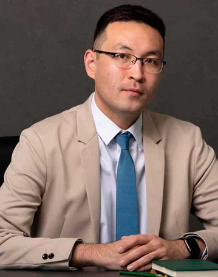
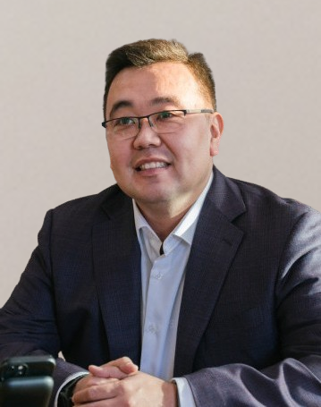
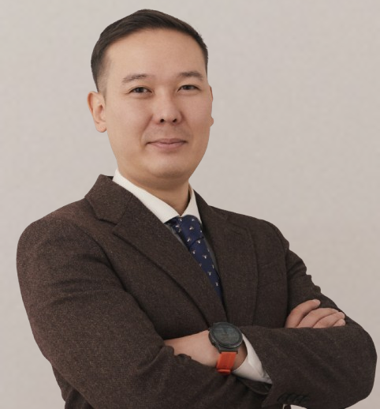
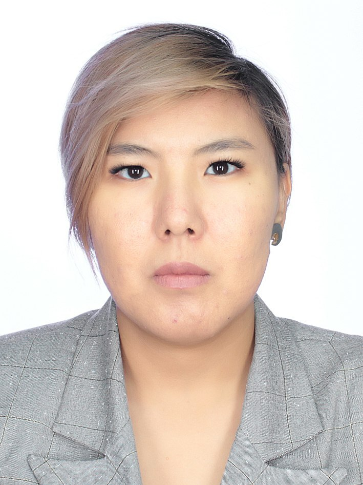
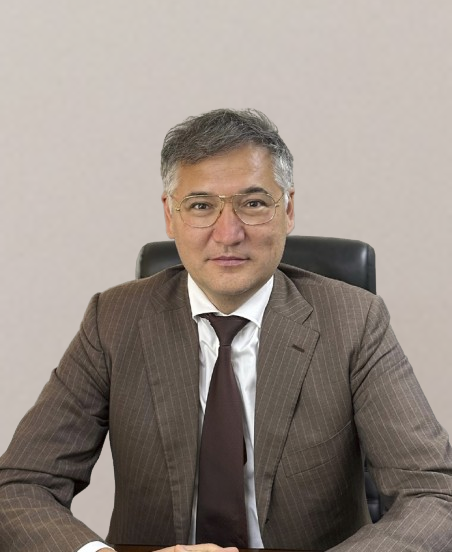
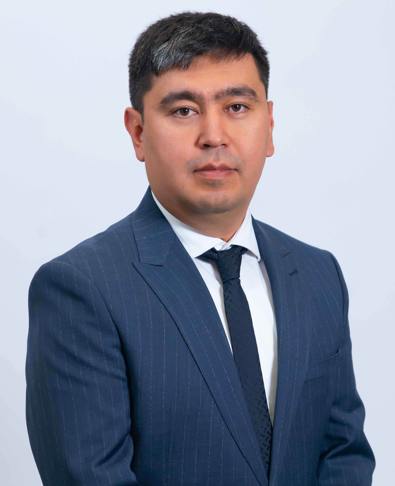
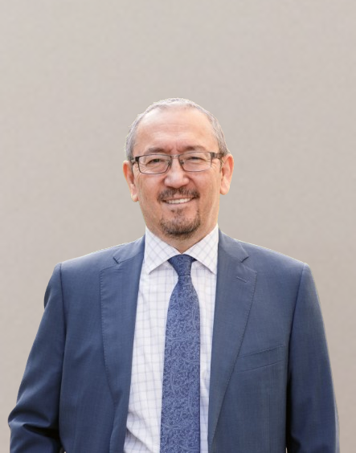
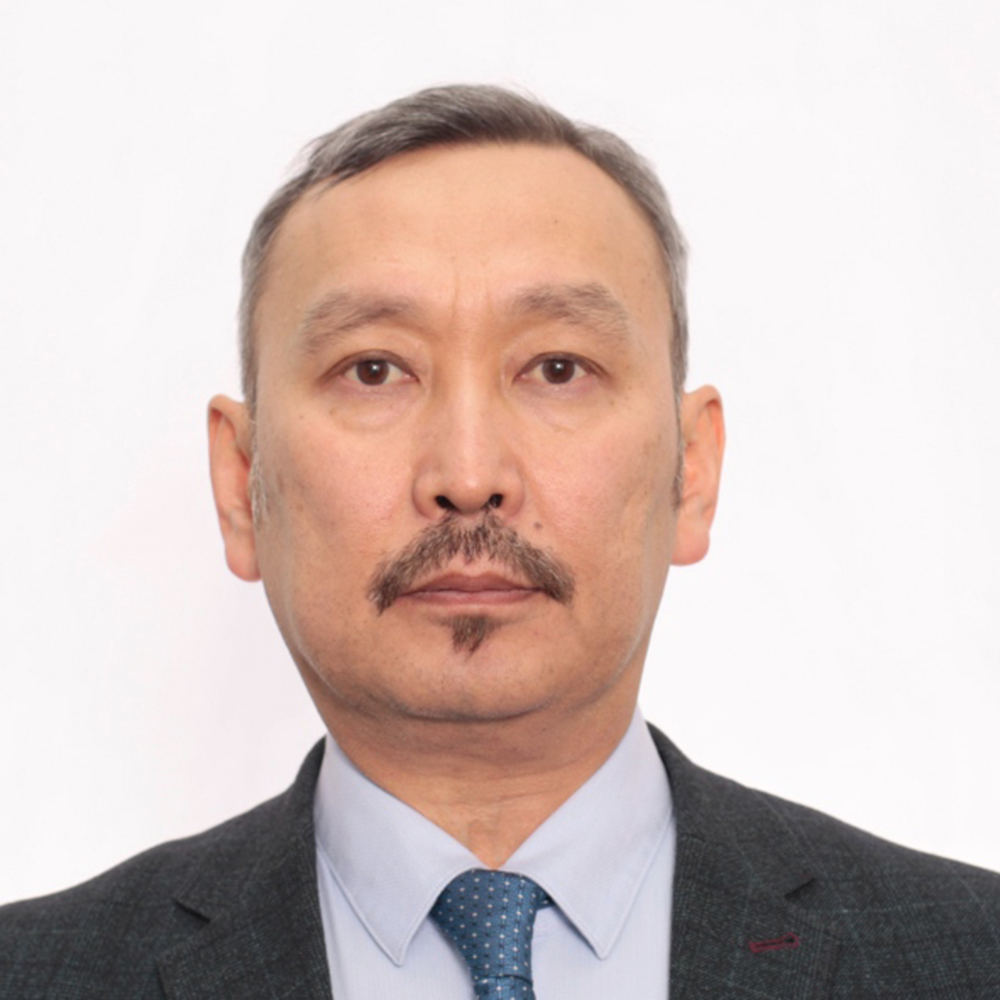
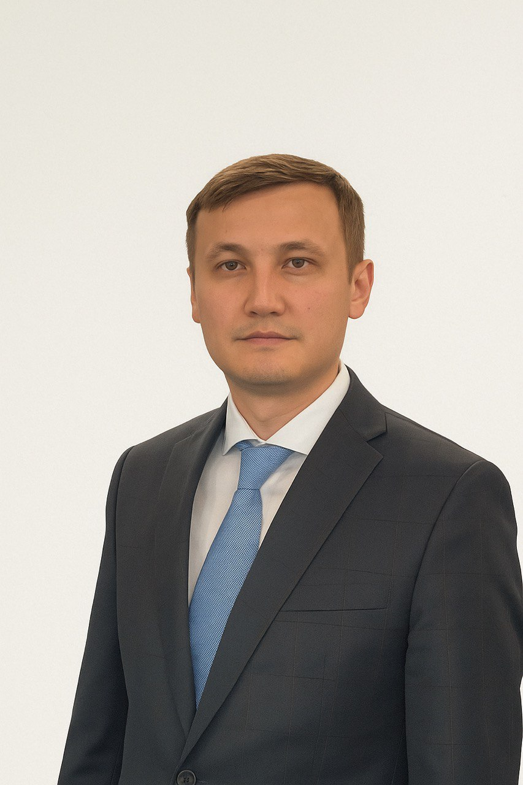

# DDC

**URL:** [https://bsbnb.kz/about-us](https://bsbnb.kz/about-us)

## Цветовая палитра страницы (Computed Colors)
- Background (Фон): `rgb(0, 0, 0)`
- Text color (Цвет текста): `rgb(0, 0, 0)`
- Header background (Фон шапки): `N/A`
- Header text color (Цвет текста шапки): `N/A`

## Заголовки (Headings)
### H1:
- Быть лидером в цифровой трансформации, обеспечивая Национальный Банк и его дочерние структуры передовыми ИТ-решениями

### H2:
- ускоряя инновации, обеспечивая стабильность и соответствие международным стандартам ISO 9001

### H3:
- ИННОВАЦИИ
- ПРОЗРАЧНОСТЬ
- КАЧЕСТВО
- НАДЕЖНОСТЬ
- ПАРТНЕРСТВО
- ВИДЕНИЕ

## Содержимое страницы (Body Text)

DigitalDevelopmentCenterNational Bank of KazakhstanБасты бетБіз туралыҚызметтерМиссияБайланыс Kz ҚРҰБ Сатып алу порталыБыть лидером в цифровой трансформации, обеспечивая Национальный Банк и его дочерние структуры передовыми ИТ-решениямиускоряя инновации, обеспечивая стабильность и соответствие международным стандартам ISO 9001

Инновации

Прозрачность

Качество

Надежность

ПартнерствоВидение Стремимся стать эталоном в области цифровой трансформации, внедряя передовые ИТ-решения для Национального Банка и его структур. Наши решения обеспечивают надежность, эффективность технологических процессов и прокладывают путь к цифровому будущему. 19962003201520172020–20232025 Создание республиканского государственного предприятия «Банковское сервисное бюро Национального Банка Республики Казахстан». Директорлар кеңесіБинур Муратұлы ЖаленовҚоғамның Директорлар кеңесінің Төрағасы,Қазақстан Республикасы Ұлттық Банкі Төрағасының орынбасарыАсхат Архатович УзбековҚоғамның Директорлар кеңесінің мүшесіҚазақстан Республикасы Ұлттық Банкінің Ақпараттық технологиялар департаментінің директорыБаян Кайратович КонирбаевҚоғамның Директорлар кеңесінің мүшесі - тәуелсіз директорАйжан Бейбытовна АриноваҚоғамның Директорлар кеңесінің мүшесіҚазақстан Республикасы Ұлттық Банкінің Цифрлық трансформация департаментінің директорыАбай Абдисаметович АлпамысовҚоғамның Директорлар кеңесінің мүшесі - тәуелсіз директорМалик Алимжанович АмардиновҚоғамның Директорлар кеңесінің мүшесі - Басқарма ТөрағасыАскар МаратҚоғамның Директорлар кеңесінің мүшесі - тәуелсіз директорБасқармаМалик Алимжанович АмардиновҚоғамның Директорлар кеңесінің мүшесі - Басқарма ТөрағасыҚұрметті интернет-пайдаланушылар!Мен сіздерді ЦДО ресми сайтында қарсы алғаныма қуаныштымын!20 жылдан астам уақыт бойы ЦДО АТ-қызметтері нарығында өз қызметін табысты жүзеге асырып келеді, бұл Ұлттық Банк үшін күрделі, кейде өте күрделі, бірақ табысты іске асырылған АТ-жобалардың әсерлі портфелін қалыптастыруға мүмкіндік берді. ЦДО қызметі серіктестіктің, сыйластықтың және меритократияның қарапайым, бірақ өте маңызды принциптеріне негізделген.Кез-келген компанияның меншігі - оның қызметкерлері, технологияларда, идеяларда, аналитикалық әзірлемелерде, оның тарихы мен дәстүрлерінде жинақталған корпоративті білімі. ЦДО ұжымын АТ-технологиялар саласында кең білімі бар және оларды тәжірибеде тиімді қолданатын тәжірибелі мамандар ұсынады. Біздің компанияның әрбір қызметкері кәсібилік, жұмыс істеуге деген құлшынысы бар және үнемі жан-жақты дамуға деген ұмтылатын қасиеттерге ие.Сайттың «Бізге жазыңыз» бөлімінде әрбір интернет-пайдаланушы өзін қызықтыратын сұрақтар қоя алады, пікірлер мен ұсыныстар қалдыра алады, сондай-ақ компанияның қызметі туралы өз пікірін айта алады. Бұл ЦДО қызметі мен алдағы жоспарлары туралы жақынырақ білуге қосымша мүмкіндік береді, сондай-ақ пайдаланушыларды қызықтыратын сұрақтарға жауап беруге мүмкіндік береді деп үміттенемін.Малик АмардиновЕрлан Дмитриевич ДурмагамбетовБасқарма Төрағасының Бірінші орынбасарыАргын Салаватович КентбековАппарат басшысыИмажанов Бахытжан ГылымбековичҚоғам Басқармасы Төрағасының орынбасарыSitemapБасты бетБіз туралыМиссияБайланысnull@1996 DDC. Барлық құқықтар қорғалған.InstagramDDC әзірлеген

## Изображения (Images)

- 
- 
- 
- 
- 
- 
- 
- 
- 
- 
- 

