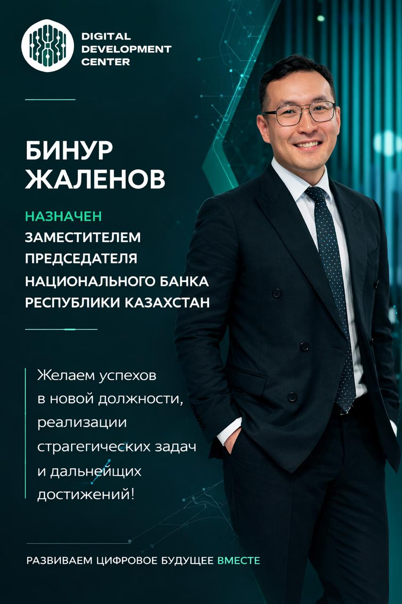
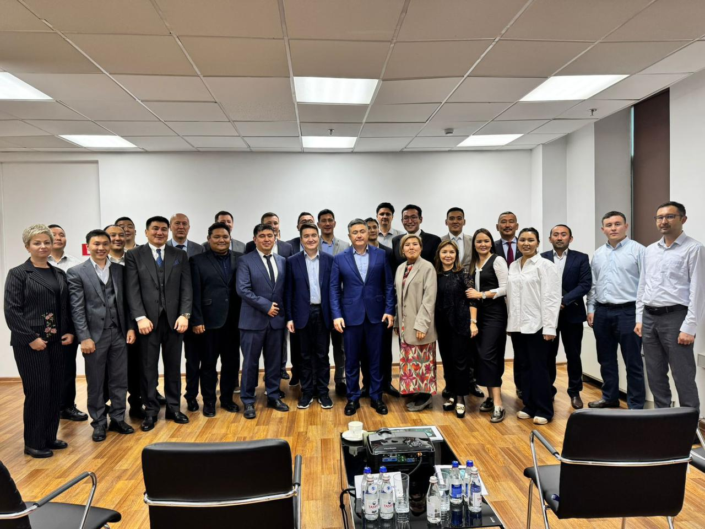

# DDC

**URL:** [https://bsbnb.kz/](https://bsbnb.kz/)

## Цветовая палитра страницы (Computed Colors)
- Background (Фон): `rgb(0, 0, 0)`
- Text color (Цвет текста): `rgb(0, 0, 0)`
- Header background (Фон шапки): `N/A`
- Header text color (Цвет текста шапки): `N/A`

## Заголовки (Headings)
### H1:
- Цифровые решения для финансовой стабильности государства

### H2:
- Цифровизация
- Информационная безопасность
- Технологический оператор данных
- Контакт-центр 1477
- Финансовая отчетность
- Гарантированное качество

### H3:
- 25
- 50/24
- 2020

## Содержимое страницы (Body Text)

DigitalDevelopmentCenterNational Bank of KazakhstanБасты бетБіз туралыҚызметтерМиссияБайланыс Kz ҚРҰБ Сатып алу порталыЦифровые решения для финансовой стабильности государстваКаталог услугГодовая финансовая отчетностьcontact_support Подробнее 

Цифровизация«Оператор портала закупок» / «Более 25 лет на рынке - Опыт, проверенный государственными сервисами»

Информационная безопасностьСопровождение и администрирование ИТ-систем

Технологический оператор данныхПрофессиональная обработка, хранение и управление информацией

Контакт-центр 1477Консультационная и техническая поддержка пользователей

Финансовая отчетность«Годовая финансовая отчетность» Скачать download

Гарантированное качествоЦифровая трансформация – подпись: Основы деятельности ЦЦР: доверие и удовлетворение потребностей заказчика25лет опытас 1996 года50/24системразработано / в эксплуатации2020запуск порталав промышленной эксплуатации Назначение Бинура Жаленова: новый этап развития цифровой экосистемы  «Цифрлық даму орталығы» АҚ Бинур Мұратұлын тағайындалуымен құттықтайды және стратегиялық міндеттерді іске асыруда, сондай-ақ елдің қаржы-технологиялық экожүйесін одан әрі дамытуда табыс тілейді. Кәсіби қызметі барысында Бинур Жаленов технологиялар мен қаржы саласында бірқатар маңызды қызметтер атқарды, оның ішінде халықаралық компаниялар мен цифрлық трансформация жобаларында жұмыс істеді. Әр жылдары технологиялық стратегия жөніндегі кеңесші болды, сондай-ақ ҚР Ұлттық Банкі ұйымдарында басшылық лауазымдарды атқарды. 2024 жылғы қыркүйектен бастап цифрлық трансформация бағытын басқарып, ҚР Ұлттық Банкі Төрағасының кеңесшісі болды.  Назначение Бинура Жаленова: новый этап развития цифровой экосистемы  #Басты  Встреча с Председателем НБ РК: итоги и ключевые проекты  #Басты SitemapБасты бетБіз туралыМиссияБайланысnull@1996 DDC. Барлық құқықтар қорғалған.InstagramDDC әзірлеген

## Изображения (Images)

- 
- 
- 

